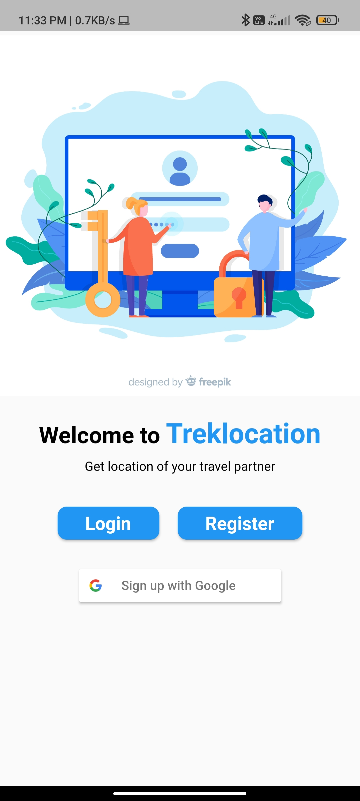
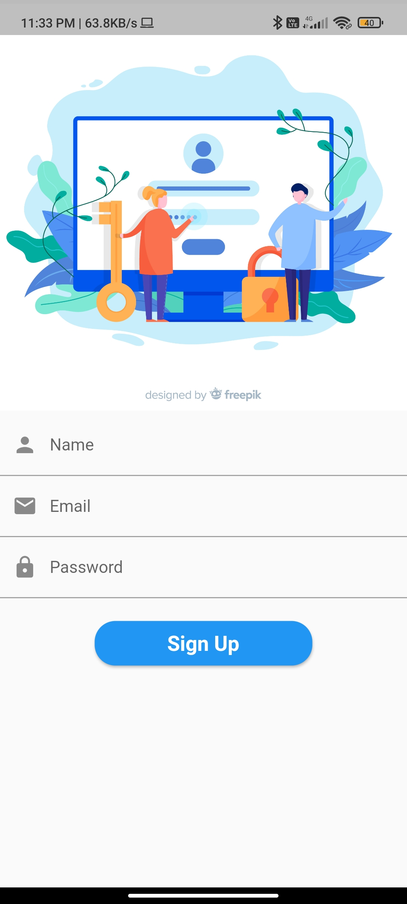
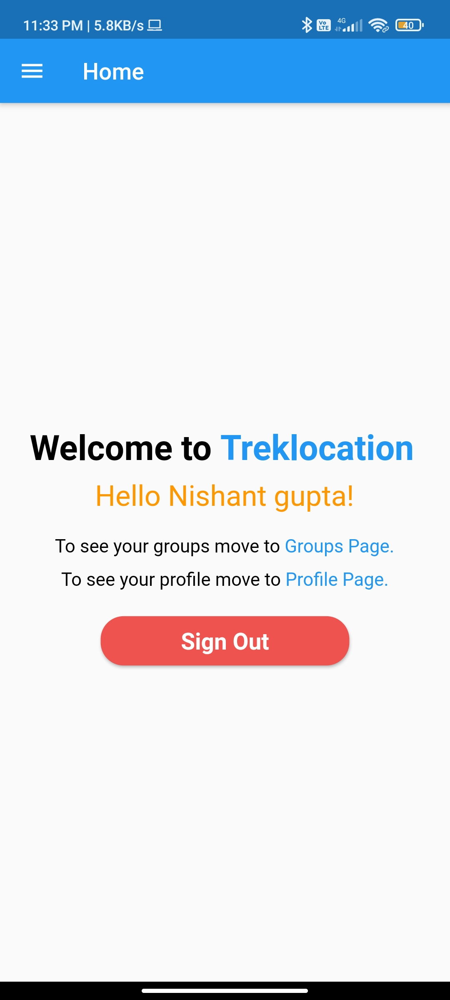
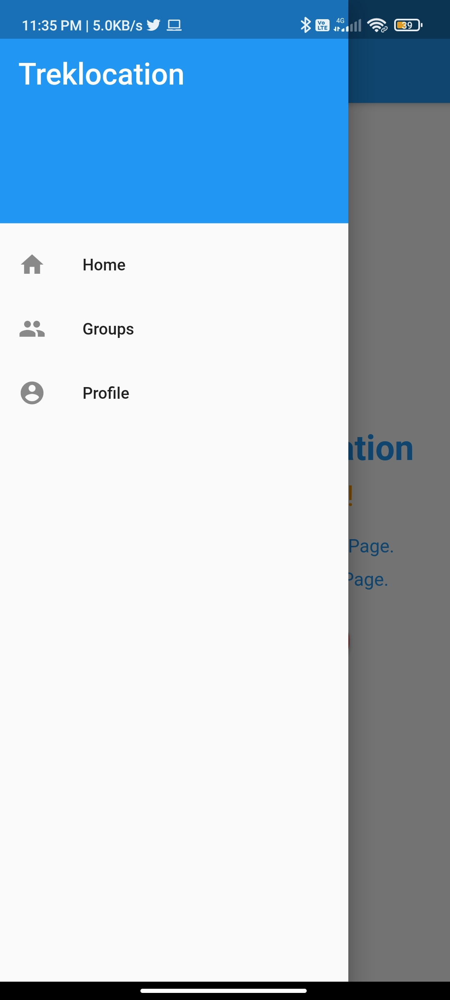
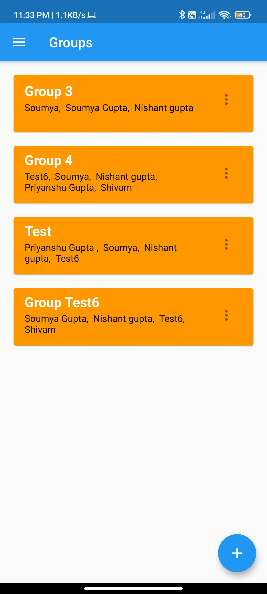
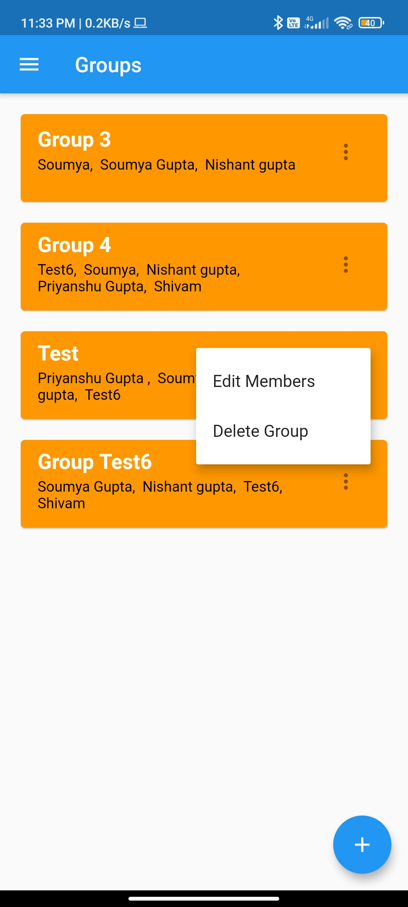
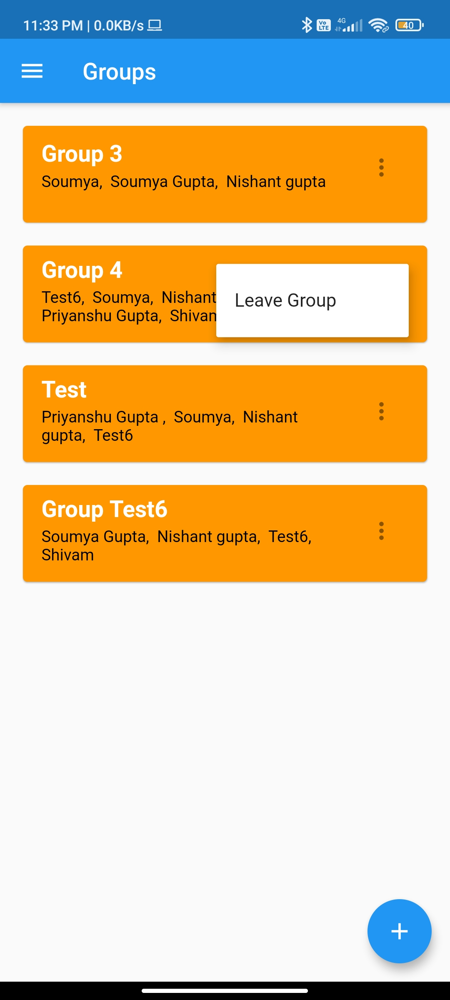
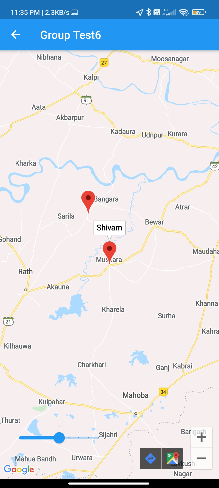

# Live-Location-Tracking-App

### A project of Coding Club IITG

In this app, you can make a group and track live location of all the users in tha group. If you are admin of the group than you edit members of the group or event delete the group. Non-admin member can leave the group if they don't want to remain part of the group. This app has the functionality of Sign in with google or any mail id.

**This project is made using Flutter SDK. Used Google Firebase for authentication and database technology and Google Maps API to display location in Google Maps.**

### Portal Screenshots:

#StartPage (where user land when he is not logged in):

#Signup Page:

#Homepage(Where user land after loggned in):

#Drawer:

#Groups(Showing all group of which user is part of):

#Group Admin Menu:

#Groups Non Admin Menu:

#Map(Showing live location of two users):

